# I2P-Address-Book-Detailed-Summary

A guide, with screenshots, to where the I2P addressbook is used, how it is used,
and what it is.

The Address Book and SusiMail
-----------------------------

The Address Book and Hidden Services Manager
--------------------------------------------

Sometimes it's desirable to share a human-readable address for a service which
is facilitated by the Hidden Services Manager. Addresses in the Hidden Services
Manager can be "Shared" on a one-to-one basis or "Published" with the assistance
of a Jump Service.

### Sharing an Address

Sharing an address happens from person-to-person:

#### Text-based:

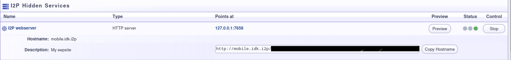

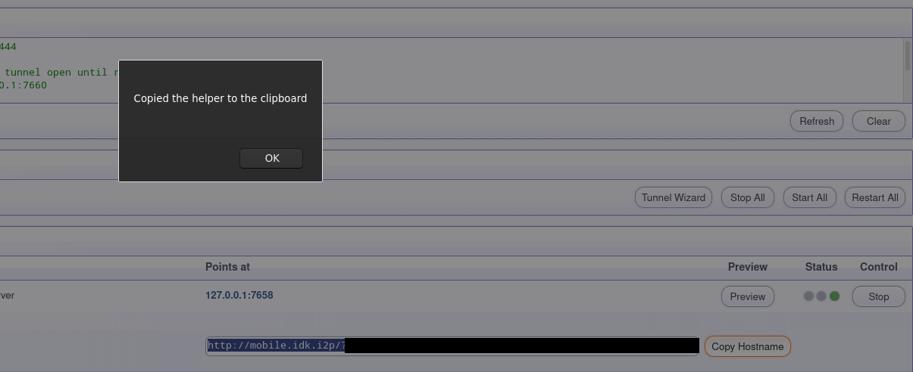

#### Image-based:

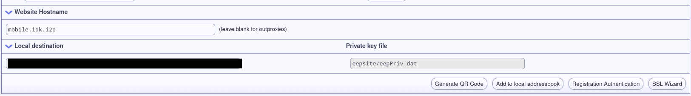

### Publishing an Address

Publishing an address happens from person-to-jump service-to-network:

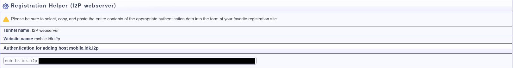

The Address Book itself:
------------------------

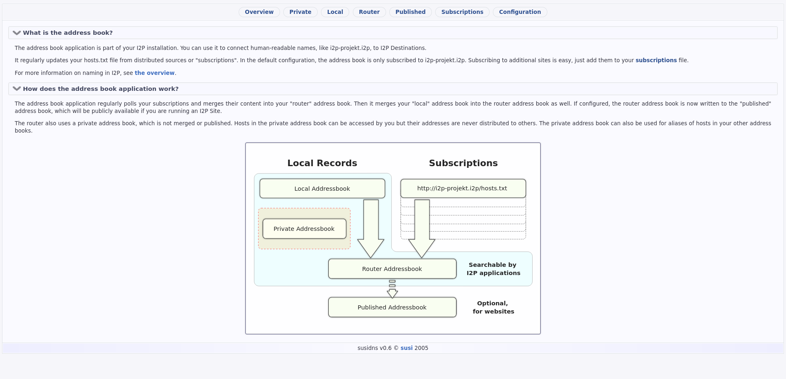
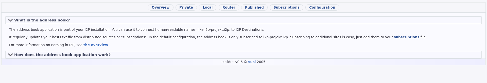
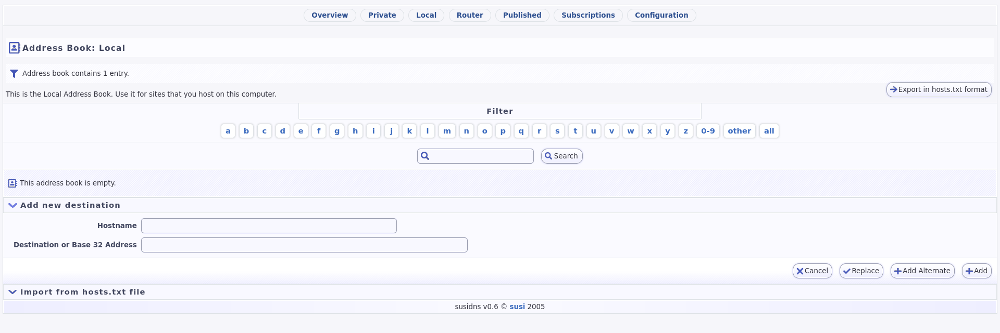
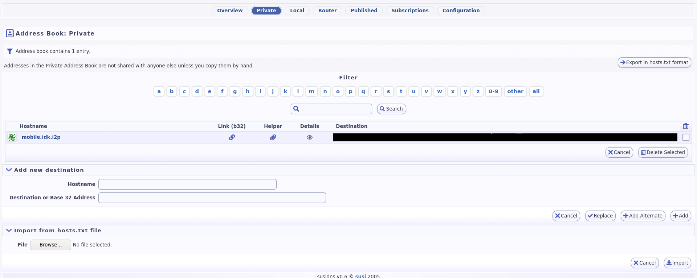
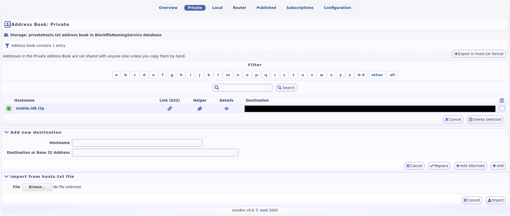
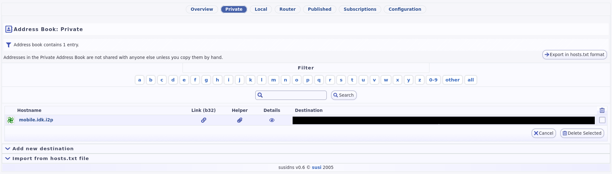
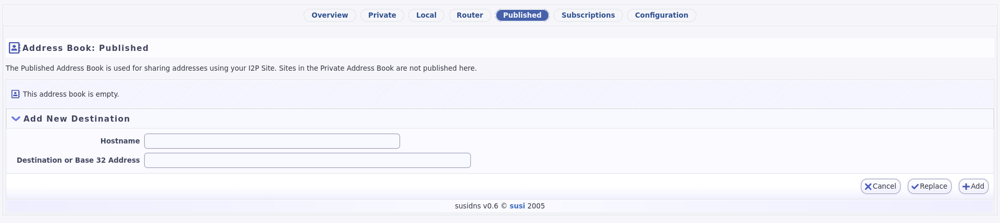
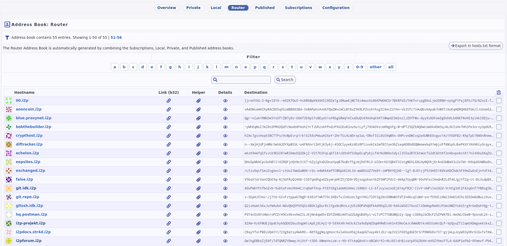
